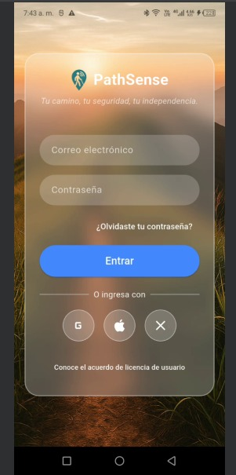
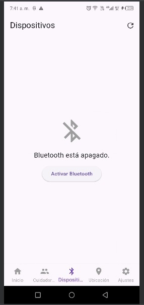
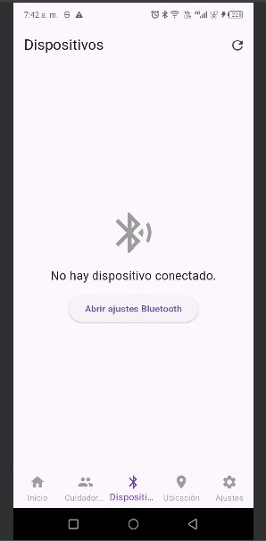
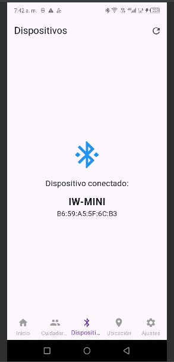
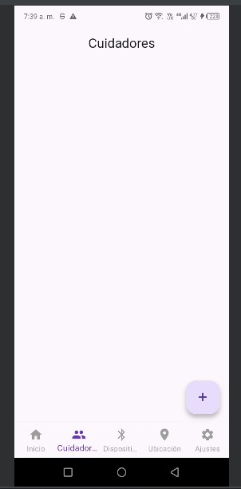
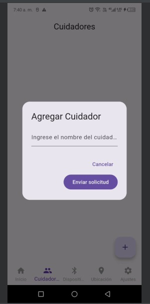
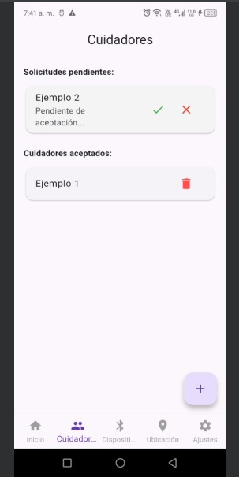
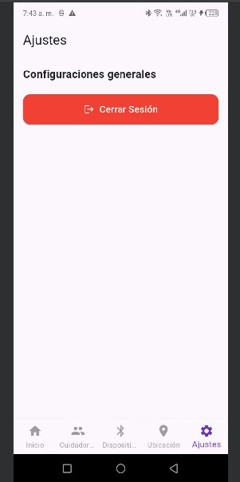
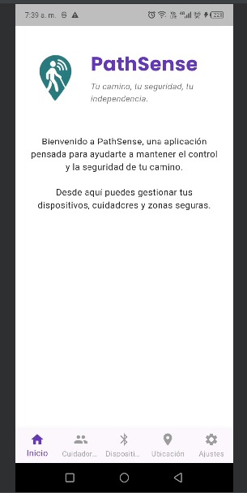
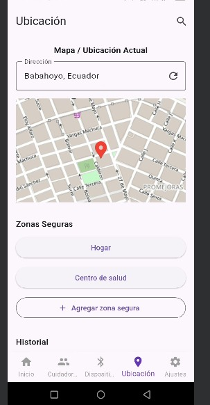

# 🚀 Aplicación baston\_bt\_app

Un proyecto Flutter en desarrollo para un **bastón inteligente con Bluetooth**.

📖 [Documentación Completa](./DOCUMENTACION.md)

## ✅ Estado del Proyecto
### 🔹 Actualización #6:
  - Página de **Ubicación de Usuario** actualizada.
  - Integración de **TTS (Text-to-Speech)** para ciertos eventos.
  - Redirección a **Google Maps** al hacer clic en una zona segura registrada, mostrando recorrido e indicaciones.

### 🔹 Actualización #5:
  - Organización del proyecto en carpetas.
  - Nuevos widgets: `login_form.dart`, `register_form.dart`, `loading_walking_widget.dart`.
  - Refactor general para mejorar la legibilidad y el mantenimiento.

### 🔹 Actualización #4:
  - Página de **Login (UI)** creada (sin lógica aún).
  - Página de **Dispositivos** completada (pendientes pruebas con el bastón para obtener ubicación).
  - Página de **Ubicación** en desarrollo (pendiente).
  - Página de **Ajustes** en desarrollo (pendiente).

### 🔹 Actualización #3:
  - Integración de Bluetooth (falta terminar configuración).
  - Página de mapa agregada (falta configurar).
  - Conexión con la base de datos en desarrollo.

### 🔹 Actualización #2:
  - Navegación funcional implementada.
  - Páginas básicas creadas: Inicio, Dispositivos, Cuidadores, Ubicación, Gestión del bastón.
  - Base de datos local lista con **SQLite encriptado**.
  - Seguridad añadida: clave de cifrado y módulo `secure.dart`.

### 🔹 Actualización #1:
  - Primer commit inicial del proyecto.

## 📌 Objetivo

Desarrollar una aplicación móvil que permita a los usuarios gestionar:

* Dispositivos conectados al bastón.
* Cuidadores asignados.
* Ubicación y zonas seguras.
* Botón de emergencia.

## 🛠️ Tecnologías

* **Flutter**
* **Dart**
* **SQLite (encriptado)**

## 📱 Capturas de la Aplicación

### 🔐 Pantalla de Login

### 📡 Pantalla de Dispositivos

### 👥 Pantalla de Cuidadores

### ⚙️ Pantalla de Ajustes

### 🏠 Pantalla de Inicio

### 🗺️ Pantalla de Mapa

## 👥 Autores

* **Kuro**
  📧 [dfoyainfo@fafi.utb.edu.ec](mailto:dfoyainfo@fafi.utb.edu.ec)

* **Moi**
  📧 [alvaradomoises2004@gmail.com](mailto:alvaradomoises2004@gmail.com)

